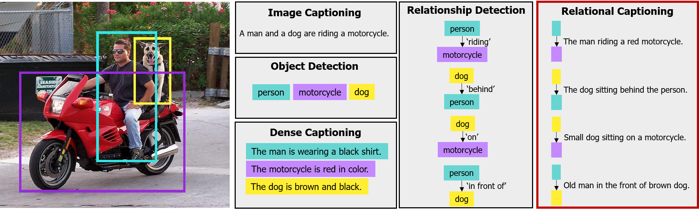

# DenseRelationalCaptioning

The code for our [CVPR 2019](https://cvpr2019.thecvf.com/) paper,
**[Dense Relational Captioning: Triple-Stream Networks for Relationship-Based Captioning](https://sites.google.com/view/relcap)**.

Done by Dong-Jin Kim, Jinsoo Choi, Tae-Hyun Oh, and In So Kweon

Link: **[arXiv](https://arxiv.org/pdf/1903.05942.pdf)** , **[Dataset](https://drive.google.com/file/d/1cCN36poslxe7cCMkLnhYK0a-Y3vO4Rfn/view?usp=sharing)**.

(The code and instruction will be available soon.)





## Citation
If you find our work useful in your research, please consider citing:
```
@inproceedings{densecap,
  title={Dense Relational Captioning: Triple-Stream Networks for Relationship-Based Captioning},
  author={Kim, Dong-Jin and Choi, Jinsoo and Oh, Tae-Hyun and Kweon, In So},
  booktitle={Proceedings of the IEEE Conference on Computer Vision and Pattern Recognition},
  year={2019}
}
```
